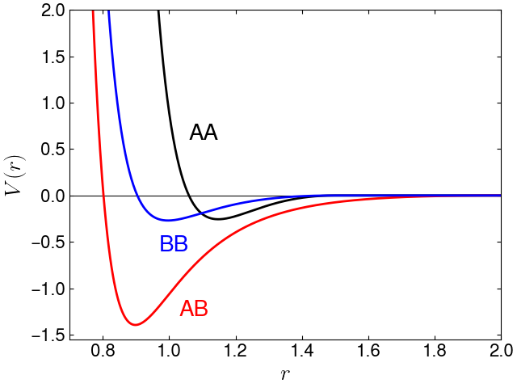
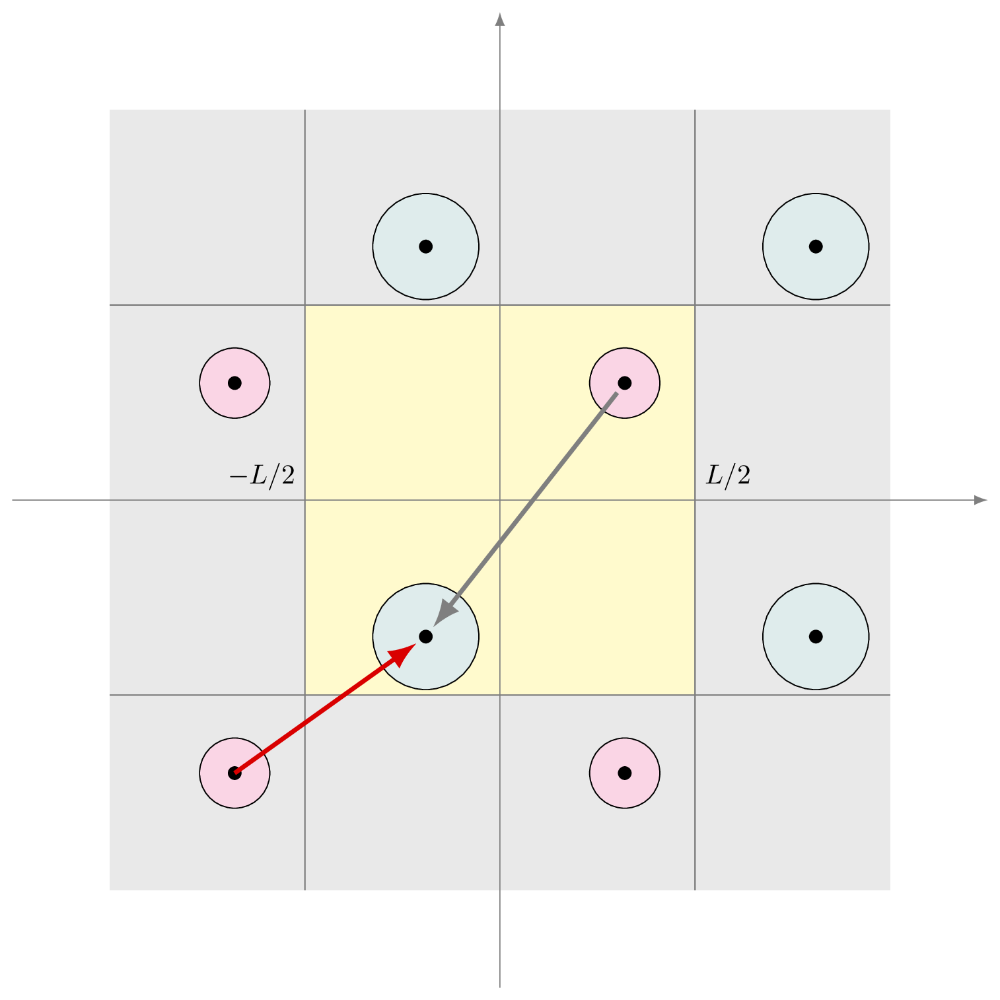

分子動力学シミュレーションの参考になりそうなコード。
目的は、[LAMMPS](https://github.com/lammps/lammps)とか[HOOMD-blue](https://github.com/glotzerlab/hoomd-blue)とか、オープンソースだけど巨大なコードを解読するのはツライ、という初学者の修養の用に供することである。

# 系

なるべくプログラムを単純にするため、このリポジトリでは一つの系に限定したコードを書く。
系の相互作用はLennard-Jonesポテンシャルとする。
クーロン力や重力などの長距離相互作用は難しいので、カットオフ付きの短距離のLJ相互作用を扱う。

粒子 $i$ と粒子 $j$ の距離を $r_{ij}$ とすると、この2粒子間の相互作用は以下の式で表される：

$$
V(r_{ij}) = \phi(r_{ij}) - \phi(r_{ij}^\mathrm{cut}) - \phi^\prime(r_{ij}^\mathrm{cut}) (r_{ij} - r^\mathrm{cut}_{ij}).
$$

但し、

$$
\phi(r_{ij}) = 4\epsilon_{ij} \left[ \left( \frac{\sigma_{ij}}{r_{ij}} \right)^{12} - \left( \frac{\sigma_{ij}}{r_{ij}} \right)^6 \right]
$$

である。

3次元系を考える。系に含まれる粒子数は $N$ とし、シミュレーションの箱の大きさ $L$ は数密度 $\rho = N/L^3 = 1.2$ より定める。
各方向で周期境界条件を採用する（下の説明も参照）。

この系には、LJパラメータ $\sigma_{ij}$ / $\epsilon_{ij}$ の異なる2成分の粒子が含まれている。
それぞれA粒子とB粒子と呼び、粒子数は80:20の割合である。
どちらも粒子の質量は $m$ とする。 各LJパラメータは以下の通り：

  |            | AA  | AB  | BB   |
  |------------|-----|-----|------|
  | $\sigma$   | 1.0 | 0.8 | 0.88 |
  | $\epsilon$ | 1.0 | 1.5 | 0.5  |

上の表式を見れば分かるように、このポテンシャルはカットオフ距離 $r_{ij}^\mathrm{cut}$ でポテンシャルと力（ポテンシャルの一階微分）が連続になるようにシフトされている。
カットオフ距離は、

-   AAとBBのとき $1.5\sigma_{AA} = 1.5$
-   ABのとき $2.5\sigma_{AB} = 2.0$

とする。 各粒子種ペアのポテンシャルをグラフにすると、こんな感じ


質量、長さ、エネルギー、時間の単位は、それぞれ $m$ 、 $\sigma_{AA}$ 、 $\epsilon_{AA}$ 、 $(m\sigma_{AA}^2/\epsilon_{AA})^{1/2}$ とする。

ちなみに、ここで導入した[2成分Lennard-Jones粒子系](https://doi.org/10.1063/5.0004093)は、Kob-Andersenモデルと呼ばれる過冷却液体の最も基本的なモデルの修正版である。
[オリジナルのKob-Andersenモデル](https://doi.org/10.1103/physreve.51.4626)とは若干異なるが、オリジナル版は低温で結晶化しやすいという難点があるため、個人的好みから修正版を用いることにする。

# 周期境界条件

液体がガラスとして固まる現象、水が沸騰する現象など、シミュレーションを行うときは、現実世界で起こっている何らかの現象に興味があることが多い。
その現象をコンピュータ上で再現するために、 $10^{23}$ 個の分子から成る系のシミュレーションをそのまま行えれば万々歳であるが、それは不可能である。
従って、実際には、1000粒子や10000粒子程度の小さい系のシミュレーションを行うことになる。
その際に問題となるのが、シミュレーションの壁では特殊なことが起こってしまうことである。満員電車に乗ったとき、座席の前に立っているときと出入口付近にいるときとでは、違った立ち居振る舞いを求められるであろう。
小さい系においても、表面の影響を排したシミュレーションを行うために、周期境界条件が用いられることが多い。

周期境界条件ではシミュレーションボックスの周囲にミラーを配置する。
下図では、黄色のボックスが中央にあり、灰色のボックスがミラーである。


Minimum-image conventionというやり方では、粒子は黄色のボックスの中に存在し、粒子間の相互作用は最も近いミラーで計算される。
もしシミュレーションの最中に黄色のボックスから飛び出たら、反対側の辺に粒子は移動する（移動距離を計算する場合は、どの方向に何回飛び出したかを記録しておく）。
詳しい説明やterminologyは教科書を参照のこと。

周期境界条件がだいたい掴めたところで、プログラムではどのように実装するのかを考えよう。
上の図で表されているように、黄色のボックスは $-L/2 < x,y,z < L/2$ に置かれていることにしよう。
粒子 $i$ の座標 $(x_i, y_i, z_i)$ を黄色のボックスに留めておくためには、シミュレーションの最中に以下のような判定を行えば良さそうだ：
- もし $x_i$ が $L/2$ より大きければ、 $x_i$ から $L$ を引く
- もし $x_i$ が $-L/2$ より小さければ、 $x_i$ に $L$ を足す
コードで書けば

```C++
if (xi > 0.5*Lbox) {
    xi -= Lbox;
} else if (xi < -0.5*Lbox) {
    xi += Lbox;
}
```

という判定をシミュレーションの最中に行えばよい。

次に、2粒子間の距離を計算する場合を考えよう。上で説明した通り、周期境界条件では粒子 $i$ と相互作用する粒子 $j$ は、粒子 $i$ と最も近いミラーの粒子を考えなければならない。
黄色のボックス内の粒子 $j$ とは限らないのである。
上の図を見られたい。
薄い青色の粒子 $i$ と相互作用する粒子 $j$ （薄い赤色の粒子）は、黄色のボックスにいるモノを選んではいけない。もっと近い粒子が左下に存在するからである。
従って、2粒子間の距離を計算する際は、灰色の矢印ではなく、赤色の矢印から計算しなければならないのだ。
これをコードで書くと、2点間のベクトルの各成分を計算し、
- $L/2$ よりも大きければ $L$ 引く
- $-L/2$ よりも小さければ $L$ 足す
ということをやれば良い。サンプルコードは

```C++
double xij = conf[i][X] - conf[j][X];
if (xij > 0.5*Lbox) {
    xij -= Lbox;
} else if (xij < -0.5*Lbox) {
    xij += Lbox;
}
```

となるだろう（ $x$ 成分しか書いてない）。

最後に数値計算上の注意を一つ。一般的に言って ~if~ 文は遅いので、なるべく減らしたい。私は上と同じことを

```C++
xij -= Lbox * std::floor(xij / Lbox + 0.5);
```

というコードで実現している。こっちの方が速い。

# 参考文献
- Allen, Tildesley, 'Computer Simulation of Liquids', Oxford University Press
- Frenkel, Smit, 'Understanding Molecular Simulation', Academic Press
